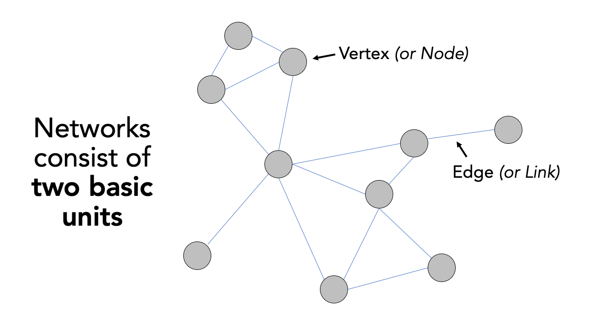

# Transport Network Analysis
This week we will cover a different type of data: network data. We will take a look at different types of network analysis and how they apply to different applications and can be used within spatial analysis. For our practical component, we will look at current some approaches to analyse road networks in R using the `dodgr` library to calculate the network distance between two points (i.e. an origin and a destination). These distances can then be used to calculate the number of a resource (e.g. fast-food outlets) within a certain distance of a POI, e.g. a school or population-weighted centroid. 

## Reading list {#reading-w07}
#### Essential readings {-}
- Geurs, K., Van Wee, B. 2004. Accessibility evaluation of land-use and transport strategies: review and research directions. *Journal of Transport Geography* 12(2): 127-140. [[Link]](https://doi.org/10.1016/j.jtrangeo.2003.10.005)
- Higgins, C., Palm, M. DeJohn, A. *et al.* 2022. Calculating place-based transit accessibility: Methods, tools and algorithmic dependence. *Journal of Transport and Land Use* 15(1): 95-116. [[Link]](https://doi.org/10.5198/jtlu.2022.2012)
- Neutens, T. Schwanen, T. and Witlox, F. 2011. The prism of everyday life: Towards a new research agenda for time geography. *Transport Reviews* 31(1): 25-47. [[Link]](https://doi.org/10.1080/01441647.2010.484153)
- Schwanen, T. and De Jong, T. 2008. Exploring the juggling of responsibilities with space-time accessibility analysis. *Urban Geography* 29(6): 556-580. [[Link]](https://doi.org/10.2747/0272-3638.29.6.556)

#### Suggested readings {-}
- Van Dijk, J., Krygsman, S. and De Jong, T. 2015. Toward spatial justice: The spatial equity effects of a toll road in Cape Town, South Africa. *Journal of Transport and Land Use* 8(3): 95-114. [[Link]](https://doi.org/10.5198/jtlu.2015.555)
- Van Dijk, J. and De Jong, T. 2017. Post-processing GPS-tracks in reconstructing travelled routes in a GIS-environment: network subset selection and attribute adjustment. *Annals of GIS* 23(3): 203-217. [[Link]](https://doi.org/10.1080/19475683.2017.1340340)

## Network Analysis 
The term network analysis covers a wide range of analysis techniques, from complex network analysis, social network analysis, link analysis, as well as road network analysis. A network or network graph is constituted by a collection of vertices that are connected to one another by edges. Note, vertices may also be called nodes or points, whilst edges may be called links or lines. Within social network analysis, you may find the terms actors (the vertices) and ties or relations (the edges) also used. 

```{r 07-network-graph, echo=FALSE, cache=TRUE, fig.align='center', fig.cap='Visualising networks through vertices and edges.'}

```

Understanding that networks are formed through the connections of vertices and edges, we can think of many naturally and manmade occurring networks that also have a precise geography to them (i.e. their distribution can be mapped directly within geographic space), including rivers connected with tributaries and animal tracks, to electricity pylons and cables and our road and street networks that form crucial parts of our infrastructure. 

The latter, in particular, have been a substantial focus of those working within spatial analysis over the last two decades, particularly with routing applications now dominating much of our day-to-day technology, from personal route-planning and ride-share apps to large-scale logistics and infrastructure applications, including the delivery operations behind all of our online shopping and even [Scotland's Trunk Road Gritters](https://www.arcgis.com/apps/webappviewer/index.html?id=2de764a9303848ffb9a4cac0bd0b1aab).

Alongside this development of routing applications, GIS analysts, geographers and public health specialists have also identified the utility of network analysis within geographic space to calculate distance-based measurement and coverage buffers that can be used as part of accessibility studies that look to understand the provision of a specific resource (e.g. greenspaces, hospitals or even fast-food stores) to a certain area of population.

### Accessibility to fast-food outlets
For this week's practical, we will be using Portsmouth in the UK as our area of interest for our analysis. One prominent topic within the city is the issue of public health and childhood obesity. According to figures released in March 2020 by Public Health England, more than one in three school pupils are overweight or obese by the time they finish primary school within the city - higher than the national average of one in four. One potential contributor to the health crisis is the ease and availability of fastfood in the city. We will measure accessibility by understanding how many fast-food outlets are within specific walking distances of each school, starting at 400m, then 800m and finally a 1km walking distance. We will then aggregate these counts at the Lower Super Output Area (LSOA) and compare these results across the city.

To get this data ready for our spatial and socio-economic analyses, we will need to first calculate the distances between our schools and fast-food outlets. This involves calculating the shortest distance a child would walk between a school and a fast-food outlet, using roads or streets. We will use the `dodgr` package to conduct a road network analysis between each school and fast-food outlet.

:::note
**Note**<br/>
All calculations within the `dodgr` library currently need to be run in WGS84/4236. This is why we will not transform the CRS of our data in this practical.
:::

### Loading data {#loading-data-w07}
The first dataset we need to download will help with the visualisation of our results: boundary data that contains an outline of Portsmouth.

| File                                    | File Type         | Link |
| :------                                     | :------      | :------ |
| Major towns and cities boundaries 2015      | `shp`        | [Download](https://github.com/jtvandijk/GEOG0114/tree/master/data/zip/major_towns.zip) |

We can now load the required libraries as well as the major towns and cities boundaries `shapefile`.

```{r load-ports, warnings=FALSE, message=FALSE, cache=TRUE, tidy=TRUE}
# libraries
library(tidyverse)
library(sf)
#library(tmap)
library(osmdata)
library(dodgr)

# load major towns and cities, filter Portsmouth
portsmouth_city <- st_read("data/outline/Major_Towns_and_Cities__December_2015__Boundaries.shp", stringsAsFactors = FALSE) %>% filter(tcity15nm == "Portsmouth")
```

To create our network and origin-destination datasets, we will need to first download data directly from OpenStreetMap using a set of specific queries. Once our data is downloaded, we will then need to extract the data from our query results.

We will go ahead and start with downloading and extracting our road network data. First, to **download the data**, we will use the `osmdata` library and the `add_osm_feature()` function. To use the function, we need to provided it with either a *bounding box* of our area of interest (AOI) or a set of points, from which the function will create its own bounding box. You can find out more about this and details on how to construct your own queries in the [data vignette](https://cran.r-project.org/web/packages/osmdata/vignettes/osmdata.html).

To download our road network dataset, we first define a variable to store our bounding box coordinates, `p_bbox()`. We then use this within our OSM query to extract specific types of road segments within that bounding box - the results of our query are then stored in an `osmdata` object. We will select all OSM features with the `highway` tag that are likely to be used by pedestrians (e.g. not `motorways`).

```{r download_osm, warnings=FALSE, message=FALSE, cache=TRUE, tidy=TRUE}
# define our bbox coordinates for Portsmouth
p_bbox <- c(-1.113197,50.775781,-1.026508,50.859941)

# pass bounding box coordinates into the OverPassQuery (opq) function
# only download features that are not classified as motorway
osmdata <- opq(bbox = p_bbox ) %>%
  add_osm_feature(key = 'highway', value = c('primary', 'secondary', 'tertiary', 'residential','path','footway', 'unclassified','living_street', 'pedestrian')) %>% 
  osmdata_sf()
```

:::note
**Note** <br />
In some instances the OSM query will return an error, especially when several people from the same locations are executing the exact same query. If this happens, you can use a prepared copy all the OSM Portsmouth Data instead: [[Link]](https://github.com/jtvandijk/GEOG0114/tree/master/data/zip/osm_portmouth.zip). These files can be loaded as normal shapefiles.
:::

You should now see an `osmdata` variable appear in your environment window. The `osmdata` object contains the bounding box of your query, a time-stamp of the query, and then the spatial data as `osm_points`, `osm_lines`, `osm_multilines` and `osm_polgyons` (which are listed with their respective fields also detailed). Some of the spatial features maybe empty, depending on what you asked your query to return. Our next step therefore is to extract our spatial data from our `osmdata` object to create our road network data set. This is in fact incredibly easy, using the traditional `$` R approach to access these spatial features from our object. 

Deciding what to extract is probably the more complicated aspect of this - mainly as you need to understand how to represent your road network, and this will usually be determined by the library/functions you will be using it within. Today, we want to extract the **edges** of the network, i.e. the lines that represent the roads, as well as the **nodes** of the network, i.e. the points that represent the locations at which the roads intersect. For our points, we will just keep the `osm_id` data field, just in case we need to refer to this later. For our lines, we will keep a little more information that we might want to use either within our road network or analysis, including the type of road, what the maximum speed is on the road, and whether the road is one-way or not. 

```{r roadnetwork, warnings=FALSE, message=FALSE, cache=TRUE, tidy=TRUE}
# extract the points, with their osm_id.
ports_roads_nodes <- osmdata$osm_points[, "osm_id"]

# extract the lines, with their osm_id, name, type of highway, max speed and oneway attributes 
ports_roads_edges <- osmdata$osm_lines[, c("osm_id", "name", "highway", "maxspeed", "oneway")]
```

To check our data set, we can quickly plot the edges of our road network using the `plot()` function:

```{r networkplot, warnings=FALSE, message=FALSE, cache=TRUE, tidy=TRUE}
plot(ports_roads_edges, max.plot=1)
```

Because we are focusing on walking, we will overwrite the `oneway` variable by suggesting that none of the road segments are restricted to one-way traffic. 

```{r roadnetwork-no-oneway, warnings=FALSE, message=FALSE, cache=TRUE, tidy=TRUE}
# overwrite one-way default
ports_roads_edges$oneway <- "no"
```
